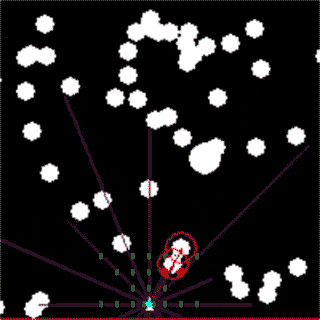

# DanmakuBot

Danmaku (弹幕) refers to these really hard arcade shoot 'em up games (like space invaders), where the entire screen gets covered in bullets, and the player has to weave between the bullets in order to survive.

Years ago, in high school (2012), I made such a game in GameMaker (since it was simple to make). Because it was such a difficult game, I attempted to implement a bot to autoplay it. This turned out to be quite hard, and the AI I wrote back then could only survive a couple of seconds before it gets stuck in a corner and died.

This is a second attempt at that problem using neural networks and evolution in 2018, before I started my first job.

As a challenge, I did not use deep learning libraries such as TensorFlow or PyTorch. Instead, everything is implemented with numpy (though as luck would have it, this can now be run on the gpu with JAX with minimal changes).

# Methodology

The agent controls a ship, which can move up, down, left and right anywhere within a small rectangle (analog controls).  An enemy spews bullets at the ship, and contact with a bullet kills the agent instantly, ending the episode.

The fitness function is simple -- number of frames survived, weighted by time spent near the centre of the screen (to help the agent avoid getting trapped).

The game is implemented from scratch in python, and can be run without rendering to save CPU. Rendering can be done using pygame.

The optimisation algorithm is simple, truncation evolution -- create agents, take best performing agents, add noise to create new population, repeat.

The agent below is trained using an AWS instance with 36 cores for ~290 generations.

  

# What I learned

* Even stupid algorithms can work really well if enough CPU is applied. In fact, this was likely a more robust algorithm than, say, simple policy gradient or DQN.

* Implementation of Neural Nets from first principles instead of using a library.

* Proper use of Version Control and GitHub for a large project

* Proper use of remote AWS paired with MultiProcessing in order to accelerate computation

* JAX for GPU accelerated tensor operations

